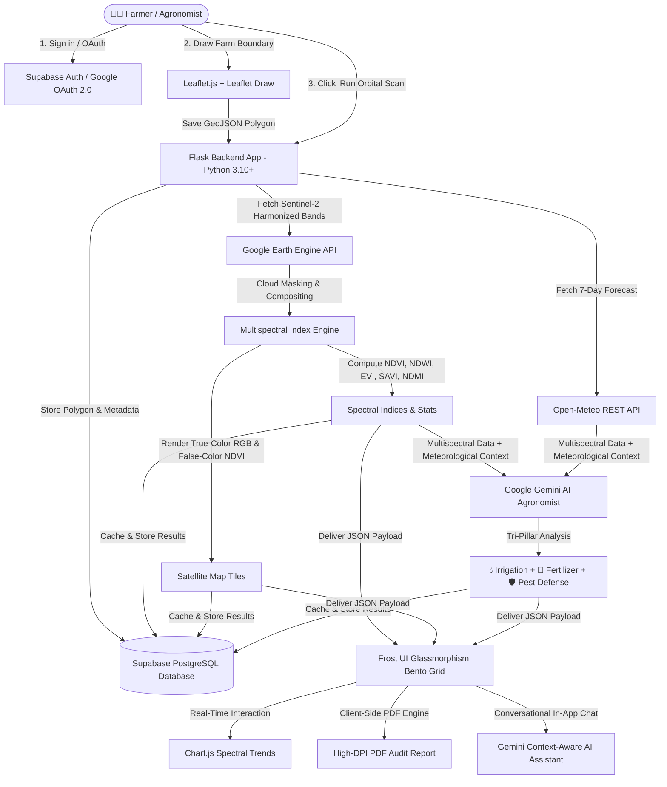

# 🛰️ TerraMind AI — Precision Agriculture & Agronomy Intelligence Platform

<div align="center">


**Next-Generation Satellite Remote Sensing & Generative AI Agronomy for Smart Agriculture**

[](https://terramind-ai.onrender.com)
[](https://www.python.org/)
[](https://flask.palletsprojects.com/)
[](https://earthengine.google.com/)
[](https://deepmind.google/technologies/gemini/)
[](https://supabase.com/)

[🌐 **Live Web Application**](https://terramind-ai.onrender.com) • [✨ Key Features](#-key-features) • [🔄 Project Flowchart](#-project-flowchart) • [🛠️ Tech Stack](#️-tech-stack) • [🚀 Quickstart](#-quickstart-guide) • [🛰️ Remote Sensing Science](#️-sentinel-2-index-formulas) • [🚢 Deployment](#-deployment-render)

</div>

---

## 🌐 Live Deployment

TerraMind AI is deployed and live on Render:
👉 **[https://terramind-ai.onrender.com](https://terramind-ai.onrender.com)**

---

## 🌾 Overview

**TerraMind AI** is an advanced agricultural intelligence and remote sensing platform designed to empower farmers, agronomists, and researchers with orbital telemetry, automated multispectral health indices, and generative AI agronomy advisories.

By synthesizing **Sentinel-2 Copernicus satellite imagery** via **Google Earth Engine** with **Google Gemini AI**, TerraMind provides automated, high-resolution crop health diagnostics, irrigation recommendations, disease risk mitigation, and hyper-local weather forecasting inside an immersive **Frost UI Glassmorphism** interface.

---

## 🔄 Project Flowchart

### 1. High-Level System Architecture & Execution Flow



### 2. Step-by-Step Data Flow

```text
┌─────────────────┐       ┌─────────────────┐       ┌────────────────────────┐
│  Farmer / User  │ ────> │ Leaflet Canvas  │ ────> │  Polygon Boundary JSON │
└─────────────────┘       └─────────────────┘       └────────────────────────┘
                                                                 │
                                                                 ▼
┌─────────────────┐       ┌─────────────────┐       ┌────────────────────────┐
│   Open-Meteo    │ <──── │  Flask Backend  │ ────> │  Google Earth Engine   │
│ 7-Day Forecast  │       │   (app.py)      │       │  Sentinel-2 SR 10m     │
└─────────────────┘       └─────────────────┘       └────────────────────────┘
        │                         │                              │
        ▼                         ▼                              ▼
┌────────────────────────────────────────────────────────────────────────────┐
│                    Multispectral Index Computation                         │
│       • NDVI (Chlorophyll)                • SAVI (Soil Adjusted)           │
│       • NDWI (Canopy Water)               • NDMI (Moisture Stress)         │
│       • EVI  (Biomass Sensitivity)        • RGB / False-Color Tiles        │
└────────────────────────────────────────────────────────────────────────────┘
                                  │
                                  ▼
┌────────────────────────────────────────────────────────────────────────────┐
│                       Google Gemini AI Agronomist                          │
│     Tri-Pillar Advisory: 💧 Precision Irrigation | 🌿 Nutrition | 🛡️ Disease │
└────────────────────────────────────────────────────────────────────────────┘
                                  │
                                  ▼
┌────────────────────────────────────────────────────────────────────────────┐
│                 Magic Bento Grid Dashboard & Live Telemetry                │
│     • Visual Gauges & Confidence Score    • One-Click PDF Audit Export     │
│     • Multi-Week Spectral Progression     • In-App Gemini Assistant        │
└────────────────────────────────────────────────────────────────────────────┘
```

---

## ✨ Key Features

### 🛰️ Orbital Telemetry & Multispectral Indices
* **Sentinel-2 Multispectral Processing**: Automated retrieval and cloud-filtered composite rendering from ESA Copernicus constellation at 10-meter spatial resolution.
* **5 Key Vegetation Indices**:
  * **NDVI (Normalized Difference Vegetation Index)**: Crop vigor, chlorophyll density, and canopy biomass.
  * **NDWI (Normalized Difference Water Index)**: Canopy water stress and plant tissue hydration level.
  * **EVI (Enhanced Vegetation Index)**: High-biomass sensitivity with atmospheric and soil background decoupling.
  * **SAVI (Soil-Adjusted Vegetation Index)**: Early-growth stage monitoring with calibrated soil reflection factor ($L=0.5$).
  * **NDMI (Normalized Difference Moisture Index)**: Moisture stress indicators across field acreage.
* **Side-by-Side Tile Comparison**: Dual layer rendering comparing True-Color RGB satellite imagery with False-Color NDVI thermal heatmaps.

### 🤖 Generative AI Agronomist (Google Gemini)
* **Tri-Pillar Field Diagnostics**:
  * 💧 **Precision Irrigation Scheduling**: Deficit/surplus water guidance matching plant evapotranspiration needs.
  * 🌿 **Crop Nutrition & Fertilizer Formulation**: Targeted N-P-K nutrient balancing based on biomass metrics.
  * 🛡️ **Disease & Pest Outbreak Prevention**: Proactive mitigation advice based on humidity and vegetation stress thresholds.
* **Context-Aware Chatbot**: Floating in-app AI assistant powered by Gemini for real-time agricultural Q&A and farm navigation.

### 🗺️ Interactive Geospatial Farm Mapping
* **Leaflet.js + Leaflet Draw**: Interactive satellite polygon boundary delineation.
* **Automated Geodesic Calculations**: Instant centroid latitude/longitude and precise acre calculation.
* **Reverse Geocoding**: Live reverse geocoding via OpenStreetMap Nominatim for automatic city/region detection.

### 📊 Magic Bento Grid & Analytics Dashboard
* **12-Column Responsive Bento Layout**: Health distribution cards, metadata gauges, Chart.js trends, and active alert timeline.
* **Live Confidence Scoring**: Automated score synthesis with real-time DOM-synced visual indicators.
* **High-Definition PDF Export Engine**: One-click client-side report export via `html2pdf.js` with high-DPI canvas capture.

### ⛅ Hyper-Local Weather Intelligence
* **Open-Meteo Integration**: 7-day predictive meteorological forecasting (temperature, UV index, precipitation probability, humidity, wind velocity).
* **Dynamic Weather Visuals Engine**: Animated weather hero with keyframe-animated icons and SVG morphing.
* **Lottie Micro-Interactions**: High-performance JSON animations via `lottie-web`.

### 🎨 Frost UI Design System
* **Deep Black Glassmorphism**: High-contrast slate typography (`#cbd5e1`), vivid emerald accents (`#10b981`), ambient floating refractions.
* **Trigonometric Click Spark Engine**: 8-particle radial physics explosion on user clicks.
* **Staggered Full-Screen Menu**: Smooth GSAP-powered navigation overlay.

---

## 🛠️ Tech Stack

| Layer | Technology |
|---|---|
| **Live Deployment** | [Render Cloud Platform](https://terramind-ai.onrender.com) (WSGI Gunicorn) |
| **Backend Framework** | Python 3.10+, Flask, Gunicorn |
| **Cloud Remote Sensing** | Google Earth Engine API (`earthengine-api`, Copernicus Sentinel-2) |
| **Generative AI** | Google Gemini Generative AI SDK (`google-generativeai`) |
| **Database & Auth** | Supabase (PostgreSQL), Supabase Python Client, Google OAuth 2.0 |
| **Mapping & GIS** | Leaflet.js, Leaflet Draw, OpenStreetMap Nominatim |
| **Frontend & UI** | Vanilla JS, Bootstrap 5.3, TailwindCSS, GSAP, Chart.js, HTML5/CSS3 |
| **Animation Engines** | Lottie-Web (`lottie.js`), CSS Keyframe Engines |
| **PDF Generation** | `html2pdf.js` (Canvas + jsPDF) |
| **Weather Telemetry** | Open-Meteo REST API |

---

## 📁 Project Structure

```text
terramindpush-main/
├── app.py                      # Flask Application Factory, Server Entrypoint & Keep-Alive Routes
├── config.py                   # Centralized Configuration & Environment Loader
├── planning.md                 # Complete PRD, TRD, System Architecture & 13-Slide PPT Deck Blueprint
├── requirements.txt            # Production Python Dependencies
├── Procfile                    # Deployment Process Manager (Gunicorn)
├── .env.example                # Environment Variable Template
├── .gitignore                  # Git Ignore Rules
│
├── credentials/                # Google Service Account Credentials (Ignored in Git)
│   └── service_account.json
│
├── routes/                     # Modular Flask Route Blueprints
│   ├── analysis.py             # Satellite Analysis & Vegetation API
│   ├── auth.py                 # Supabase User Auth, Google OAuth & Session Management
│   ├── chatbot.py              # Google Gemini Conversational In-App Guide
│   ├── farms.py                # Geospatial Farm Creation & Portfolio CRUD
│   ├── feedback.py             # User Feedback Collection Route
│   └── weather.py              # Weather Intelligence & Telemetry API
│
├── services/                   # Business Logic & Cloud Service Wrappers
│   ├── advisor.py              # Rule-based fallback agronomy heuristic engine
│   ├── analysis_service.py     # Satellite Pipeline Orchestration & Analysis History
│   ├── earth_engine.py         # Earth Engine API Client Utilities
│   ├── farm_service.py         # Database CRUD Operations for Farms & User Profiles
│   ├── gee_auth.py             # Google Earth Engine Service Account Authentication
│   ├── image_service.py        # Tile image processing & thumbnail generation
│   ├── satellite_engine.py     # Sentinel-2 Multispectral Index Pipeline & Composite Generator
│   ├── supabase_service.py     # Supabase Database & Admin Client
│   └── weather_service.py      # Open-Meteo Integration Pipeline
│
├── static/                     # Static Client Assets
│   ├── animations/             # Lottie Animation JSON Schemas
│   ├── css/                    # Custom Stylesheets (Frost UI, Glassmorphism)
│   ├── js/                     # Client Scripts (auth.js, analysis.js, dashboard.js)
│   ├── images/                 # Brand Assets (logo-terramind.png)
│   └── videos/                 # Atmospheric Background Media (dew.mp4)
│
└── templates/                  # Jinja2 HTML Templates
    ├── index.html              # Marketing Landing Page
    ├── landing.html            # Landing Page Template
    ├── login.html              # Authentication (Login)
    ├── register.html           # Authentication (Register / Deploy Farm)
    ├── dashboard.html          # Main User Dashboard & Weather Hero (Frost Bento Grid)
    ├── farms.html              # Farm Portfolio Management
    ├── add_farm.html           # Farm Boundary Polygon Mapping Tool (Leaflet)
    ├── edit_farm.html          # Farm Boundary Editing Tool
    ├── analysis.html           # Satellite Analysis Workspace
    ├── history.html            # Historical Spectral Scan Timeline
    ├── weather.html            # 7-Day Weather Intelligence Forecast
    ├── advisory.html           # AI Agronomist Advisory Center
    ├── profile.html            # User Settings & Profile Hub
    └── settings.html           # Account & Security Settings
```

---

## 🚀 Quickstart Guide

### 1. Prerequisites
* **Python 3.10+** installed on your machine.
* **Google Cloud Platform (GCP)** account with Earth Engine API enabled.
* **Google Gemini API Key** from [Google AI Studio](https://aistudio.google.com/).
* **Supabase Project** with URL and API keys.

### 2. Clone the Repository
```bash
git clone https://github.com/Spandan-cyber/TerraMind-AI.git
cd TerraMind-AI
```

### 3. Setup Virtual Environment
```bash
# Windows
python -m venv .venv
.venv\Scripts\activate

# macOS / Linux
python3 -m venv .venv
source .venv/bin/activate
```

### 4. Install Dependencies
```bash
pip install --upgrade pip
pip install -r requirements.txt
```

### 5. Configure Environment Variables
Create a `.env` file in the root directory:
```bash
cp .env.example .env
```

Edit `.env` with your actual API credentials:
```env
# Flask Session Key
SECRET_KEY=your_secure_random_flask_secret_key
FLASK_ENV=development

# Supabase
SUPABASE_URL=https://your-project.supabase.co
SUPABASE_KEY=your_supabase_anon_public_key
SUPABASE_SERVICE_KEY=your_supabase_service_role_key

# Google Gemini AI
GEMINI_API_KEY=your_gemini_api_key

# Google Earth Engine
EE_PROJECT=your-gcp-project-id
GEE_SERVICE_ACCOUNT_EMAIL=your-service-account@your-project.iam.gserviceaccount.com
GOOGLE_APPLICATION_CREDENTIALS=credentials/service_account.json
```

### 6. Run the Application Locally
```bash
python app.py
```
Open your browser and navigate to:
```text
http://127.0.0.1:5000
```

---

## 🔐 Environment Variables

| Variable | Description | Required |
|---|---|:---:|
| `SECRET_KEY` | Secret key for signing Flask user session cookies | Yes |
| `SUPABASE_URL` | Endpoint URL for your Supabase project instance | Yes |
| `SUPABASE_KEY` | Anonymous public API key for Supabase client requests | Yes |
| `SUPABASE_SERVICE_KEY` | Service role key for administrative Supabase actions | Yes |
| `GEMINI_API_KEY` | Google Gemini API key for automated crop advisory generation | Yes |
| `EE_PROJECT` | Google Cloud Project ID with Earth Engine API enabled | Yes |
| `GEE_SERVICE_ACCOUNT_EMAIL` | Service Account email address authorized for Earth Engine | Yes |
| `GOOGLE_APPLICATION_CREDENTIALS`| Path to the Google Service Account JSON key file | Yes |
| `FLASK_ENV` | Environment mode (`development` or `production`) | Optional |

---

## 🛰️ Sentinel-2 Index Formulas

| Index | Name | Formula | Agricultural Meaning |
|---|---|---|---|
| **NDVI** | Normalized Difference Vegetation Index | $\frac{B8 - B4}{B8 + B4}$ | Primary plant health, chlorophyll content, and canopy density |
| **NDWI** | Normalized Difference Water Index | $\frac{B8 - B11}{B8 + B11}$ | Canopy water stress and plant tissue hydration level |
| **EVI** | Enhanced Vegetation Index | $2.5 \times \frac{B8 - B4}{B8 + 6 \times B4 - 7.5 \times B2 + 1}$ | Improved sensitivity in high biomass regions with canopy background isolation |
| **SAVI** | Soil-Adjusted Vegetation Index | $\frac{(B8 - B4) \times (1 + L)}{B8 + B4 + L} \quad (L=0.5)$ | Calibrated vegetation index for low canopy / high soil visibility |
| **NDMI** | Normalized Difference Moisture Index | $\frac{B8 - B11}{B8 + B11}$ | Moisture levels to detect field drought stress |

---

## 🚢 Deployment (Render)

The project includes a production-ready `Procfile` for one-click deployment on **Render**:

```text
web: gunicorn --timeout 120 --workers 2 app:app
```

### Steps to Deploy on Render:
1. Connect your GitHub repository (`https://github.com/Spandan-cyber/TerraMind-AI.git`).
2. Select **Python 3** Environment.
3. Build Command: `pip install -r requirements.txt`.
4. Start Command: `gunicorn --timeout 120 --workers 2 app:app`.
5. Health Check Path: `/api/health`.
6. Add your `.env` variables under **Environment Variables**.
7. Upload your `service_account.json` under **Secret Files** and set `GOOGLE_APPLICATION_CREDENTIALS` to `/etc/secrets/service_account.json`.

---

## 📄 License

This project is licensed under the **MIT License** — see the [LICENSE](LICENSE) file for details.

---

<div align="center">
  <sub>Built with ❤️ by <b>Spandan Das</b> and the TerraMind Team. Powered by Google Earth Engine & Google Gemini.</sub><br>
  <sub>Live Web App: <a href="https://terramind-ai.onrender.com">https://terramind-ai.onrender.com</a></sub>
</div>
