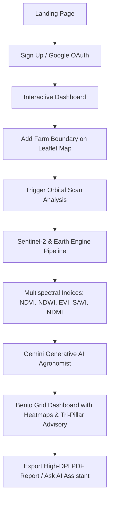
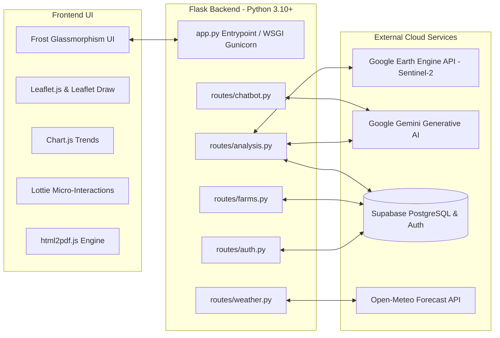

# 🛰️ TerraMind AI — Complete Product Planning, PRD, TRD & Presentation Deck

---

## 📌 Executive Summary

**TerraMind AI** is an advanced, end-to-end precision agriculture and agronomy intelligence platform designed to eliminate guesswork in farming. By fusing **orbital telemetry (Copernicus Sentinel-2 satellite imagery via Google Earth Engine)** with **Generative AI agronomy (Google Gemini)** and **hyper-local meteorological models (Open-Meteo)**, TerraMind delivers automated crop diagnostics, multispectral health index heatmaps, and proactive tri-pillar advisories (irrigation, fertilization, disease control) in an immersive **Frost UI Glassmorphism** interface.

---

# 📑 PART 1: Product Requirements Document (PRD)

## 1. Problem Statement
* **Traditional Agriculture Dilemmas**: Farmers lack real-time visibility into crop health and soil moisture distribution across large acreages.
* **Resource Inefficiencies**: Over-fertilization leads to soil degradation and unnecessary expenses; inefficient irrigation wastes water and stresses crops.
* **Delayed Disease Detection**: Crop blight and pest infestations are typically identified only after visible physical damage occurs, resulting in yield losses of 20–40%.
* **Complex GIS Software**: Existing remote sensing tools (QGIS, ArcGIS) are complicated, expensive, and inaccessible to individual growers and agronomists.

## 2. Product Vision & Value Proposition
* **Effortless Precision Agriculture**: Map any farm boundary on an interactive satellite canvas in seconds.
* **Automated Orbital Telemetry**: Fetch 10-meter resolution multispectral satellite data on demand without manual GIS processing.
* **Actionable Generative AI Agronomy**: Convert complex spectral numbers into plain-language, field-specific agricultural action plans.
* **All-in-One Farm Hub**: Weather forecasts, historical scan comparisons, PDF audit reports, and an AI chat assistant in a single glassmorphism dashboard.

## 3. User Personas
| Persona | Role | Primary Goal | Pain Point |
|---|---|---|---|
| **Ramesh Patel** | Individual Farmer (15–50 acres) | Maximize yield, optimize irrigation & fertilizer spending | High fertilizer costs, uncertain weather, limited agronomic guidance |
| **Dr. Elena Vance** | Commercial Agronomist | Monitor multiple client farms remotely and generate audit reports | Time-consuming physical field visits and tedious manual report creation |
| **Rajesh Sharma** | Agri-Enterprise Manager | Manage distributed farm portfolios, assess systemic risk | Lack of centralized digital telemetry and historical yield trend tracking |

## 4. User Journey


## 5. Functional Requirements
* **FR-1: Authentication & User Management**: Email/password signup with Supabase Auth + One-Click Google OAuth 2.0, profile persistence (avatar, name, phone).
* **FR-2: Geospatial Farm Portfolio (CRUD)**: Leaflet.js drawing tools, geodesic polygon area calculation (acres/hectares), reverse geocoding via OpenStreetMap Nominatim.
* **FR-3: Multispectral Orbital Analysis**: Dynamic cloud-masked composite generation from Sentinel-2 SR Harmonized; computation of NDVI, NDWI, EVI, SAVI, and NDMI.
* **FR-4: Dual-Imagery Visual Tile Layering**: True-Color RGB satellite tile rendering and false-color color-mapped NDVI heatmap tiles.
* **FR-5: Tri-Pillar AI Advisory Engine**: Automated generation of:
  * 💧 Irrigation Scheduling (water deficit/surplus guidance)
  * 🌿 Nutrient & Fertilizer Balancing (N-P-K recommendations)
  * 🛡️ Disease & Pest Outbreak Prevention (humidity/biomass thresholds)
* **FR-6: 7-Day Predictive Weather Intelligence**: Real-time Open-Meteo telemetry (UV index, temperature, precipitation probability, humidity, wind velocity).
* **FR-7: Historical Spectral Scan Archive**: Persistent timeline of past analyses with multi-date index progression.
* **FR-8: One-Click High-DPI PDF Report Generator**: Client-side canvas export via `html2pdf.js` for field distribution.
* **FR-9: In-App AI Agronomy Assistant**: Floating conversational chatbot powered by Google Gemini for real-time agronomy Q&A.

## 6. Non-Functional Requirements
* **Performance**: API responses for satellite computations completed within 10–25 seconds; UI page load under 1.5s.
* **Scalability**: Stateless Flask WSGI architecture with Gunicorn workers capable of horizontal autoscaling.
* **Security**: Role-Based / Row-Level Security (RLS) via Supabase; GCP service account credentials stored in encrypted secret vaults.
* **Responsive Design**: Fully optimized across desktop, tablet, and mobile browsers using responsive Tailwind & Bootstrap utilities.

---

# 🛠️ PART 2: Technical Requirements Document (TRD)

## 1. System Architecture Diagram


## 2. Remote Sensing Multispectral Formulas
TerraMind processes 12 spectral bands from Copernicus Sentinel-2 satellites:
* **NDVI (Normalized Difference Vegetation Index)**:
  $$\text{NDVI} = \frac{B8 - B4}{B8 + B4}$$
  *(Measures chlorophyll density, green canopy vigor, and overall biomass)*
* **NDWI (Normalized Difference Water Index)**:
  $$\text{NDWI} = \frac{B8 - B11}{B8 + B11}$$
  *(Detects canopy water stress and plant tissue hydration)*
* **EVI (Enhanced Vegetation Index)**:
  $$\text{EVI} = 2.5 \times \frac{B8 - B4}{B8 + 6 \times B4 - 7.5 \times B2 + 1}$$
  *(Decouples atmospheric haze and soil background in high-biomass regions)*
* **SAVI (Soil-Adjusted Vegetation Index)**:
  $$\text{SAVI} = \frac{(B8 - B4) \times (1 + L)}{B8 + B4 + L} \quad (L=0.5)$$
  *(Calibrated index for early crop stages where soil reflectance is prominent)*
* **NDMI (Normalized Difference Moisture Index)**:
  $$\text{NDMI} = \frac{B8 - B11}{B8 + B11}$$
  *(Detects field drought stress and irrigation deficits)*

## 3. Database Schema (Supabase PostgreSQL)

```sql
-- 1. User Profiles
CREATE TABLE profiles (
    id UUID PRIMARY KEY REFERENCES auth.users(id) ON DELETE CASCADE,
    full_name TEXT,
    phone TEXT,
    profile_image TEXT,
    created_at TIMESTAMP WITH TIME ZONE DEFAULT NOW(),
    updated_at TIMESTAMP WITH TIME ZONE DEFAULT NOW()
);

-- 2. Farm Boundaries & Metadata
CREATE TABLE farms (
    id UUID PRIMARY KEY DEFAULT gen_random_uuid(),
    user_id UUID REFERENCES profiles(id) ON DELETE CASCADE,
    farm_name TEXT NOT NULL,
    crop TEXT,
    village TEXT,
    district TEXT,
    state TEXT,
    notes TEXT,
    area NUMERIC,
    latitude NUMERIC,
    longitude NUMERIC,
    centroid JSONB,
    bbox JSONB,
    boundary JSONB NOT NULL,
    created_at TIMESTAMP WITH TIME ZONE DEFAULT NOW()
);

-- 3. Analysis History & Multispectral Scans
CREATE TABLE analysis_history (
    id UUID PRIMARY KEY DEFAULT gen_random_uuid(),
    user_id UUID REFERENCES profiles(id) ON DELETE CASCADE,
    farm_id UUID REFERENCES farms(id) ON DELETE CASCADE,
    indices JSONB NOT NULL,
    satellite JSONB,
    weather JSONB,
    health JSONB,
    advisory JSONB,
    result JSONB,
    created_at TIMESTAMP WITH TIME ZONE DEFAULT NOW()
);
```

## 4. API Endpoints Specification

| Method | Route | Description | Auth Required |
|---|---|---|:---:|
| `POST` | `/api/login` | Email/password sign in | No |
| `POST` | `/api/register` | User signup & profile creation | No |
| `GET` | `/auth/google` | Google OAuth initiation | No |
| `GET` | `/auth/google/callback` | Google OAuth callback handler | No |
| `GET/POST`| `/logout` | Clears session and redirects | No |
| `GET` | `/api/me` | Current user profile & dashboard summary | Yes |
| `GET` | `/api/farms` | List all farms for user | Yes |
| `POST` | `/api/farms` | Create new farm polygon | Yes |
| `GET` | `/api/farms/<id>` | Fetch single farm details | Yes |
| `PUT` | `/api/farms/<id>` | Update farm metadata | Yes |
| `DELETE`| `/api/farms/<id>` | Delete farm | Yes |
| `POST` | `/api/analysis/<farm_id>` | Trigger Earth Engine Sentinel-2 analysis | Yes |
| `GET` | `/api/analysis/history/<farm_id>`| Fetch historical scans for farm | Yes |
| `GET` | `/api/weather` | Open-Meteo 7-day predictive forecast | Yes |
| `POST` | `/api/chatbot` | Google Gemini AI assistant endpoint | Yes |
| `GET` | `/api/health` | Service health check / keep-alive | No |

---

# 📊 PART 3: Complete Presentation / PPT Deck Blueprint

*Use the 13-slide structure below for creating your PowerPoint, Canva, Pitch, or Google Slides presentation.*

---

### 🪧 Slide 1: Cover / Title Slide
* **Slide Title**: TerraMind AI
* **Subtitle**: Next-Generation Satellite Remote Sensing & Generative AI Agronomy Platform
* **Tagline**: Empowering Sustainable Agriculture with Orbital Telemetry and AI Intelligence
* **Presenter**: Spandan Das & The TerraMind Team
* **Visuals**: TerraMind emerald logo, deep-space satellite background with glassmorphism glowing badges (`Sentinel-2`, `Google Earth Engine`, `Gemini Pro`, `Supabase`).

---

### 🪧 Slide 2: The Agricultural Crisis (The Problem)
* **Slide Title**: Challenges in Modern Agriculture
* **Key Points**:
  1. **Blind Farming**: Over 80% of small and mid-sized farms rely on visual inspection, discovering diseases only after severe crop damage.
  2. **Chemical Overuse & Cost**: Over-application of synthetic fertilizers increases farming costs by 30% and causes long-term soil toxicity.
  3. **Water Inefficiency**: Sub-optimal irrigation schedules deplete groundwater reservoirs and induce crop water stress.
  4. **The GIS Accessibility Barrier**: Satellite remote sensing has traditionally required expensive GIS workstations and specialized data science skills.
* **Speaker Notes**: Highlight how farmers are forced to make high-stakes decisions every week without data, risking their livelihoods.

---

### 🪧 Slide 3: The Solution — TerraMind AI
* **Slide Title**: Orbital Telemetry Meets Generative AI
* **Key Pillars**:
  * **Orbital Resolution**: Instant 10m Sentinel-2 multispectral scans without manual GIS software.
  * **Multi-Index Spectral Math**: Real-time NDVI, NDWI, EVI, SAVI, and NDMI calculations.
  * **AI Agronomist**: Google Gemini translates spectral curves into customized field advisories.
  * **Zero Learning Curve**: A single click on an interactive map gives growers instant intelligence.
* **Visuals**: Diagram showing Satellite $\rightarrow$ Google Cloud $\rightarrow$ AI Processing $\rightarrow$ Farmer Dashboard.

---

### 🪧 Slide 4: Market Opportunity & Demographics
* **Slide Title**: Market Size & Addressable Audience
* **Market Numbers**:
  * **Global Precision Farming Market**: Projected to reach **$19.2B+ by 2030** (CAGR: 13.5%).
  * **Target Users**:
    * Individual Smallholder & Commercial Farmers.
    * Independent Agronomists and Crop Consultants.
    * Agricultural Cooperatives, Fertilizer Providers, and Agri-Insurers.
* **Value Created**: 20–30% reduction in fertilizer waste, 15–25% water conservation, and 10–18% yield improvement.

---

### 🪧 Slide 5: Core Feature Deep-Dive
* **Slide Title**: Product Capabilities & User Experience
* **Feature Grid**:
  * 🗺️ **Geospatial Boundary Delineation**: Interactive polygon mapping with geodesic acre calculations.
  * 🛰️ **Multispectral Scan Engine**: Automated cloud masking and composite generation.
  * 📊 **Magic Bento Grid**: Visual gauges, Chart.js multi-week spectral curves, and confidence metrics.
  * ⛅ **Hyper-Local Meteorological Forecast**: 7-day predictive weather metrics from Open-Meteo.
  * 📄 **High-DPI PDF Export**: One-click field audit report generation.
  * 💬 **Gemini In-App Assistant**: Context-aware chatbot for real-time farming questions.

---

### 🪧 Slide 6: Remote Sensing & Multispectral Science
* **Slide Title**: Deep-Dive: Satellite Telemetry Pipeline
* **Spectral Indices Breakdown**:
  * **NDVI**: Chlorophyll absorption vs. near-infrared reflection (Canopy Vigor).
  * **NDWI**: Water canopy absorption (Moisture Deficit).
  * **EVI**: Atmospheric decoupling for dense vegetative canopies.
  * **SAVI**: Soil reflectance calibration for young crops.
  * **NDMI**: Early drought detection.
* **Visuals**: Table of Sentinel-2 band equations and side-by-side RGB vs. False-Color NDVI visual tiles.

---

### 🪧 Slide 7: AI Agronomist Architecture (Google Gemini)
* **Slide Title**: Tri-Pillar Generative Advisory Engine
* **Advisory Pillars**:
  1. 💧 **Precision Irrigation Scheduling**: Deficit/surplus water guidance matching plant evapotranspiration needs.
  2. 🌿 **Targeted Nutrient Balancing**: Precision N-P-K fertilizer recommendations tailored to biomass density.
  3. 🛡️ **Disease & Pest Outbreak Prevention**: Early warning alerts based on humidity and vegetation stress thresholds.
* **Speaker Notes**: Explain how Gemini evaluates weather data + multispectral distributions simultaneously to generate realistic advice.

---

### 🪧 Slide 8: Interactive Mapping & Geospatial Engine
* **Slide Title**: Polygon Drawing & Geospatial Intelligence
* **Key Features**:
  * **Leaflet.js + Leaflet Draw**: Intuitive satellite canvas for boundary delineation.
  * **Geodesic Calculation Engine**: Instant centroid latitude/longitude and exact area calculation.
  * **Reverse Geocoding**: OpenStreetMap Nominatim integration for automatic village, district, and state detection.
* **Visuals**: UI mockup of polygon drawing on satellite imagery with live area calculation badge.

---

### 🪧 Slide 9: System Architecture & Cloud Infrastructure
* **Slide Title**: Scalable, Resilient Cloud Architecture
* **Stack**:
  * **Frontend**: HTML5/CSS3, JavaScript, GSAP Animations, Lottie-web, Frost UI Glassmorphism.
  * **Backend**: Python 3.10+, Flask, Gunicorn WSGI Server.
  * **Database & Auth**: Supabase PostgreSQL, Row-Level Security, Google OAuth 2.0.
  * **Cloud APIs**: Google Earth Engine API, Google Gemini Pro API, Open-Meteo API.
  * **Hosting**: Render (Cloud PaaS with Zero-Downtime Deploys).

---

### 🪧 Slide 10: Frost UI Glassmorphism Design System
* **Slide Title**: Consumer-Grade Aesthetics for Agronomy
* **Design Elements**:
  * **Deep Slate & Pure Black Canvas**: Eye-strain-free high contrast dark mode.
  * **Vibrant Emerald Accents (`#10b981`)**: Modern agricultural visual identity.
  * **Lottie JSON Micro-Interactions**: Fluid visual feedback for telemetry loading.
  * **Particle Click-Spark Physics**: Trigonometric radial particle explosions for tactile micro-interactions.

---

### 🪧 Slide 11: Business Model & Monetization
* **Slide Title**: Commercial Strategy & Monetization
* **Tiers**:
  * **Freemium Grower**: 1 Farm, Basic NDVI analysis, 3-day weather forecast.
  * **Pro Farmer ($9/month)**: Unlimited Farms, Full 5-Index Multispectral Suite, Gemini AI Agronomist, High-DPI PDF Exports.
  * **Agronomist / Enterprise ($49/month)**: Multi-client portfolio management, API access, bulk export, automated anomaly alerts.
  * **B2B Data Licensing**: Anonymized macro-level crop health analytics for insurance and supply chain forecasting.

---

### 🪧 Slide 12: Future Roadmap & Innovations
* **Slide Title**: Future Milestones & Product Evolution
* **Roadmap**:
  * **Phase 1 (Current)**: Sentinel-2 Multispectral + Gemini Agronomist + Leaflet Mapping.
  * **Phase 2 (Q3 2026)**: Drone Imagery Upload & High-Resolution (sub-meter) Orthomosaics.
  * **Phase 3 (Q4 2026)**: IoT Soil Sensor Hardware Integration (LoRaWAN moisture & pH probes).
  * **Phase 4 (2027)**: Offline Mobile App (PWA) with SMS/WhatsApp Agri-Alerts for rural growers.

---

### 🪧 Slide 13: Conclusion & Live Demonstration
* **Slide Title**: Sustainable Farming Powered by Intelligence
* **Key Takeaway**: TerraMind transforms satellite data into actionable agronomy, ensuring food security and sustainable farming.
* **Call to Action**: Explore the live demo & GitHub repository!
* **Links**:
  * **GitHub**: [https://github.com/Spandan-cyber/TerraMind-AI](https://github.com/Spandan-cyber/TerraMind-AI)
  * **Live Platform**: [https://terramind.ai](https://github.com/Spandan-cyber/TerraMind-AI)
* **Q&A**: Open for questions and discussion.

---
*Document prepared for TerraMind AI Presentation, PRD, and TRD documentation.*
